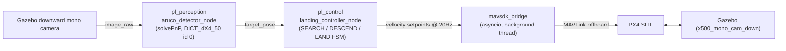
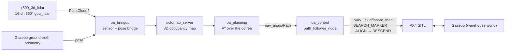
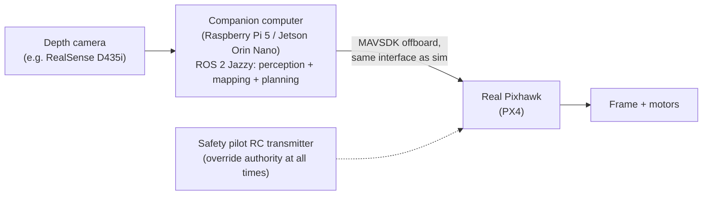

# AviationSim

<p align="center">
  <a href="media/aviationsim_gazebo_px4_demo.mp4"><strong>▶ Watch the Gazebo/PX4 navigation and precision-landing demo</strong></a>
  &nbsp;&nbsp;|&nbsp;&nbsp;
  <a href="oa_rl/results/research_paper.pdf"><strong>📄 Read the research paper (PDF)</strong></a>
</p>

A simulation-first autonomous-drone stack built on **PX4 SITL + Gazebo Harmonic +
ROS 2 Jazzy + MAVSDK**, developed as a series of milestones: classical
vision-based control (Milestones 1-2), then a research pivot comparing that
classical controller against a learned residual RL policy trained in NVIDIA
Isaac Lab (Milestone 3). Everything here runs in simulation; a possible
(not-yet-attempted) real-hardware follow-up is sketched at the bottom.

## Environment

- Ubuntu 24.04, ROS 2 Jazzy
- PX4-Autopilot v1.16.0, cloned as a sibling directory: `~/PX4-Autopilot`
  (kept outside this repo / gitignored — see [`sim_assets/`](#repo-layout) for
  why that matters)
- Gazebo Harmonic (`gz-sim8`)
- MAVSDK (Python, `mavsdk` pip package)
- OpenCV with `cv2.aruco` support (Milestone 1 & 2)
- NVIDIA Isaac Sim 5.1 + Isaac Lab (cloned to `~/IsaacLab`), in a `uv`-managed
  Python 3.11 venv at `~/lab` — a separate stack from ROS 2/PX4 above
  (Milestone 3 only)

## Repo layout

```
AviationSim/
├── precision_landing_ws/        ROS 2 workspace (src/ has the buildable packages)
│   └── src/
│       ├── pl_perception/       Milestone 1: ArUco marker detection
│       ├── pl_control/          Milestone 1: MAVSDK offboard bridge + landing FSM
│       ├── pl_bringup/          Milestone 1: launch files + params
│       ├── oa_bringup/          Milestone 2: LiDAR + pose bridging
│       ├── oa_planning/         Milestone 2: 3D occupancy grid + A* planner
│       ├── oa_control/          Milestone 2: MAVSDK trajectory follower +
│       │                         post-course ArUco landing FSM
│       └── oa_vio/              Unused appendix: OpenVINS VIO integration,
│                                 removed from the active pipeline (see
│                                 Milestone 2 below) but kept on disk
├── sim_assets/                  Gazebo worlds/models/airframes for Milestone 2,
│                                 version-controlled here and symlinked into the
│                                 PX4-Autopilot clone by scripts/link_gz_assets.sh
├── oa_rl/                       Milestone 3: Isaac Lab RL task for the
│                                 classical-vs-RL research pivot (kept outside
│                                 ~/IsaacLab, same "engine external, project
│                                 code in-repo" pattern as PX4-Autopilot/oa_vio)
├── scripts/
│   ├── launch_sim.sh            One-command PX4 + Gazebo + ROS 2 launch (Milestone 1)
│   ├── link_gz_assets.sh        Symlinks sim_assets/ into ~/PX4-Autopilot
│   ├── build_openvins.sh        Builds the (now-unused) OpenVINS VIO dependency
│   └── hover_test.py            Standalone MAVSDK hover smoke test
└── README.md
```

**Why `sim_assets/` exists:** PX4-Autopilot is gitignored from this repo, but
custom Gazebo worlds/models/airframe scripts have to physically live inside
the PX4 clone's directory tree to be usable. `sim_assets/` is the source of
truth (tracked here in git); `scripts/link_gz_assets.sh` symlinks each piece
into place and — for airframes — patches the one PX4 `CMakeLists.txt` line
that registers a new `gz_<model>` make target. Re-run it any time you re-clone
PX4-Autopilot.

## Milestone 1 — GPS-denied precision landing

**Goal:** land on a 0.5 m ArUco marker using only vision + baro altitude for
the final approach — without disabling GPS at the estimator level, so PX4's
offboard mode and failsafes behave normally. "GPS-denied" is enforced only at
the control-law level (the landing controller simply never looks at GPS).

**Pipeline:**


- `pl_perception/aruco_detector_node`: subscribes to the bridged Gazebo camera,
  detects the marker, publishes a body-frame `target_pose` via solvePnP.
- `pl_control/landing_controller_node` + `mavsdk_bridge`: a state machine
  (SEARCH → converge → DESCEND → LAND) that runs an expanding-square search
  pattern to hunt for the marker, then closes a horizontal PI loop on the
  marker offset while descending, then hands off to `Action.land()` below
  `final_land_alt_m`.
- `pl_bringup`: launch file + `control_params.yaml` / `marker.yaml`.

**Run:** `bash scripts/launch_sim.sh`

**Status:** takeoff/landing mechanics work end-to-end; marker acquisition
reliability is the active work item (the expanding-square search was the most
recent addition, to actively hunt for the marker instead of assuming it's
directly below).

## Milestone 2 — 3D obstacle avoidance & path planning

**Goal:** fly a 3D-LiDAR-equipped drone through an indoor "warehouse" full of
pillars without colliding, using a real-time occupancy map and an A* planner,
then hand off to a Milestone-1-style ArUco landing once the goal is reached.

**Pipeline:**


A custom `warehouse.sdf` world (three rows of pillars in a bounded room, each
row's gaps offset from the next so flying straight through one row's gap
always puts a pillar from the next row directly ahead — a proper slalom, not
a single detour) and an `x500_3d_lidar` vehicle model (a 16-channel,
360°, gpu_lidar sensor mounted on the standard PX4 x500 quad, plus a
downward mono camera) give the drone something real to navigate around and,
at the end, land on. `oa_bringup` bridges the LiDAR's point cloud and pose
into ROS 2; `octomap_server` folds that into a running 3D occupancy map;
`oa_planning` runs A* over the map to produce a collision-free path to the
goal; `oa_control`'s `path_follower_node` walks that path via the same
MAVSDK-offboard-over-a-background-asyncio-thread pattern Milestone 1's
`mavsdk_bridge` uses, then — once the goal is reached — extends into
`SEARCH_MARKER → ALIGN_MARKER → DESCEND_MARKER → LANDED` states reusing
Milestone 1's `aruco_detector_node` and PI controller directly.

**On GPS-denial:** an OpenVINS-based VIO pipeline (`oa_vio`) was built and
wired in as a GPS-denied localization source, matching Milestone 1's
philosophy, but ran into persistent divergence under this vehicle's motion
profile with no guaranteed fix timeline. It was fully removed from the active
pipeline (kept unused on disk as appendix/future-work material) in favor of
Gazebo's ground-truth pose — a deliberate scope decision tied to the Milestone
3 pivot below, where training/evaluating an RL policy needs privileged state
anyway, so GPS-denial stopped being the load-bearing goal here.

**Status:** verified end-to-end — takeoff, a full collision-free flight
through all three pillar rows to the goal, then finds and lands on the ArUco
marker placed there.

**Run:**
```bash
bash scripts/link_gz_assets.sh
cd ~/PX4-Autopilot
PX4_GZ_WORLD=warehouse PX4_GZ_MODEL_POSE="-8.5,0,0.2,0,0,0" make px4_sitl gz_x500_3d_lidar
```
Then, with the sim running: `gz topic -l | grep scan` / `gz topic -e -t /scan/points`
to see the live point cloud (the LiDAR sensor uses lazy publishing, so the
topic only appears once something subscribes to it).

## Milestone 3 — Hybrid imitation + residual RL (Isaac Lab)

**Goal:** compare the classical obstacle-avoidance controller, standalone RL,
and a learned residual correction on four metrics: success, trajectory
efficiency, decision overhead, and held-out robustness. The RL task covers 2D
navigation only; descent and ArUco landing remain the verified classical FSM
from Milestones 1-2.

Training runs in GPU-parallel Isaac Lab because PX4/Gazebo lockstep episodes
took 60-190 seconds. `oa_rl` is an external Isaac Lab project registering
`Isaac-WarehouseAvoidance-Direct-v0`. It uses a velocity-commanded planar drone
at 1.5 m altitude in the same staggered-pillar geometry. The residual policy
observes the classical proposal and adds a bounded correction; a precomputed
Dijkstra goal-flow field is the vectorized analogue of the Gazebo A* plus
trajectory-follower baseline.

The experiment infrastructure is now implemented:

- deterministic classical/standalone/residual evaluation through one harness;
- JSON and per-episode CSV evidence with success, path, efficiency, command
  smoothness, clearance, residual magnitude, and compute timing;
- an identity-residual warm start and PPO resume path;
- seeded nominal, moderate, and severe robustness profiles;
- success-conditioned comparison reports, preventing early collisions from
  appearing artificially path-efficient.

### Current quantitative result

Nominal evaluation used 1,024 episodes per controller:

| Controller | Success | Time (s) | Path (m) | Efficiency | Variation (m/s²) | Clearance (m) | Latency (ms) |
|---|---:|---:|---:|---:|---:|---:|---:|
| Classical | 100% | 20.050 | 20.051 | 0.8329 | 8.648 | 0.335 | 0.146 |
| Standalone RL | 100% | 13.680 | 20.521 | 0.8138 | 9.423 | 0.075 | 0.200 |
| Penalized residual RL | 100% | 12.000 | 17.281 | 0.9664 | 1.167 | 0.375 | 0.328 |

Residual RL retains 100% success while completing 40.1% faster than classical,
using a 13.8% shorter path, improving efficiency by 16.0%, reducing command
variation by 86.5%, and increasing minimum clearance by 11.9%. Its combined
classical lookup plus policy latency is 0.328 ms, below 1% of the 40 ms control
period.

The moderate held-out profile randomizes spawn, actuator gain, wind, and
observation noise across 1,024 seeded episodes:

| Controller | Success | Collision | Successful efficiency | Reliability-adjusted efficiency | Clearance (m) |
|---|---:|---:|---:|---:|---:|
| Classical | 100% | 0% | 0.8136 | 0.8136 | 0.367 |
| Standalone RL | 89.7% | 10.3% | 0.8169 | 0.7331 | 0.233 |
| Residual RL | 100% | 0% | 0.9445 | 0.9445 | 0.410 |

This is the strongest result so far: residual RL preserves classical
reliability under perturbation and materially improves route quality, while
standalone RL collides in 10.3% of episodes.

### Imitation warm-start finding

The first near-zero supervised checkpoint exposed closed-loop distribution
shift: despite open-loop MSE `4.65e-5`, its remaining `0.193 m/s` residual
caused 100% timeouts. The corrected pretrainer projects the output head to the
exact zero-residual teacher optimum; its 1,024-episode behavior then matched
classical exactly while keeping PPO exploration std at 0.10.

A 100-iteration fine-tune used 19,660,800 steps and took 52.67 seconds. The
warm start kept mean residual to 0.046 m/s at iteration 50 and 0.109 m/s at
iteration 100, but random initialization achieved better fixed-layout nominal
performance at the same budgets (0.298 and 0.526 m/s residual respectively).
The honest conclusion is that identity pretraining controls initial policy
authority; it is not a nominal sample-efficiency win.

### Current status and conclusion

Nominal, moderate, and paired severe matrices are complete with 1,024 episodes
per controller. Under severe perturbations, residual RL succeeded in
1,023/1,024 scenarios with no collisions; classical succeeded in 615/1,024,
and standalone RL in 834/1,024 with 188 collisions.

The selected residual was exported and integrated into the Gazebo/PX4 follower
as an opt-in bounded correction. Earlier uninterrupted transfer attempts failed:
residual v3 timed out amid empty A* replans, experimental v4 recovery collided,
and v5 failed closed without completing. The unsafe recovery was removed.

A real-time transport defect was then fixed so offboard velocity uses the newest
setpoint instead of accumulating stale FIFO commands. In the v10 smoke pair,
classical and residual-assisted runs both completed navigation and ArUco
precision landing. Residual inference covered 679/1,462 controller samples
before safe permanent fallback. This validates the guarded hybrid pipeline, not
uninterrupted policy transfer or statistical Gazebo superiority. Residual
control remains disabled by default pending repeated paired trials.

See [`oa_rl/results/final_report.md`](oa_rl/results/final_report.md) for the
plots and consolidated conclusion, [`oa_rl/README.md`](oa_rl/README.md) for
setup and provenance, and [`MILESTONE2_STATUS.md`](MILESTONE2_STATUS.md) for
the chronological engineering record. No real-hardware validation was
attempted.

## Optional: real-hardware test (not attempted, not committed to)

Everything above is simulation only. Moving any of it onto real hardware is a
substantial, separate effort with real safety/legal/cost stakes that
simulation doesn't have, and **this section is a draft sketch for later
discussion, not a plan that's been validated or started.**

**Proposed scope:** a small, low-risk bench/tethered test of *one slice* of
the Milestone 2 pipeline — not a full untethered obstacle-avoidance flight on
the first attempt.

**Draft architecture:**



- **Airframe:** an existing small quad frame (5"–7" class), not a new build.
- **Companion computer:** Raspberry Pi 5 or Jetson Orin Nano running the same
  ROS 2 Jazzy stack, so `oa_planning`/`oa_control` code doesn't need to change
  between sim and hardware — only the sensor driver and the MAVLink endpoint
  (SITL → real Pixhawk) change.
- **Flight controller:** a real Pixhawk running PX4, talked to via the same
  MAVSDK offboard interface already used in sim.
- **Sensor swap:** the sim uses a full 3D LiDAR; a real spinning LiDAR
  (Livox/RPLiDAR) is a bigger, pricier, heavier first step. A depth camera
  (Intel RealSense D435i) is the more realistic first hardware sensor —
  which means the occupancy-mapping node would need to consume depth-camera
  point clouds instead of the 360° LiDAR sweep, a real (if contained) change
  from what Milestone 2 builds in sim.
- **Suggested validation ladder** (each step must pass before the next):
  1. **Bench test, props off:** run perception + mapping + planning against
     the real depth camera, verify the occupancy map and planned path look
     sane in RViz.
  2. **Tethered hover:** verify MAVSDK offboard setpoints are accepted and
     sane on the real Pixhawk, still tethered, no obstacles yet.
  3. **Supervised low-altitude indoor hover with obstacles:** only after 1
     and 2 both pass cleanly, and only with the safety pilot ready to take
     over instantly.

Timeline, exact hardware choices, and even whether to pursue this at all are
still open — treat this section as a starting point for a conversation, not
a committed roadmap.
