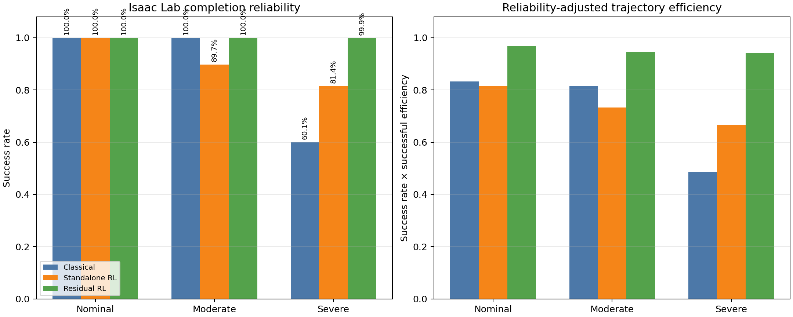
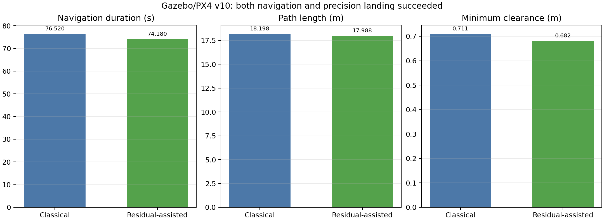
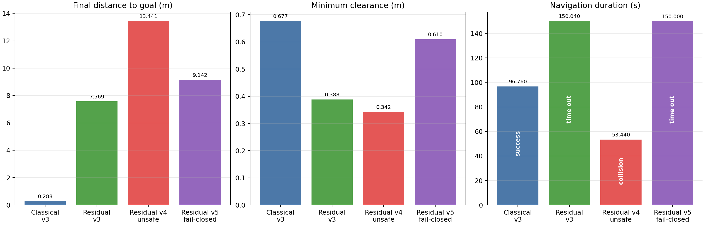

# Final controller evaluation report

## Result

Residual RL is the strongest controller in the Isaac Lab training/evaluation
domain. In Gazebo/PX4, uninterrupted direct residual transfer did not validate,
but the bounded fail-closed hybrid completed navigation and precision landing
in the v10 residual-assisted smoke trial. Residual inference ran for 679/1,462
controller samples before an empty replan permanently handed control back to
the classical follower.

The evidence therefore supports two distinct claims: residual RL strongly
improves the Isaac-domain controller, and the guarded residual-assisted
Gazebo/PX4 pipeline can complete end to end. It does not establish reliable
uninterrupted policy transfer or statistical superiority in Gazebo.

## Isaac Lab comparison

Each row below is based on 1,024 episodes. Severe runs use paired scenario IDs
across controllers. The legacy moderate artifacts share the intended seed and
configuration but do not record scenario IDs, so only the severe profile
supports paired inference. Robustness route metrics are conditioned on
success, while reliability-adjusted efficiency penalizes failures.

| Profile | Controller | Success | Collision | Successful efficiency | Reliability-adjusted efficiency | Clearance (m) |
|---|---|---:|---:|---:|---:|---:|
| Nominal | Classical | 100.0% | 0.0% | 0.8329 | 0.8329 | 0.335 |
| Nominal | Standalone RL | 100.0% | 0.0% | 0.8138 | 0.8138 | 0.075 |
| Nominal | Residual RL | 100.0% | 0.0% | 0.9664 | 0.9664 | 0.375 |
| Moderate | Classical | 100.0% | 0.0% | 0.8136 | 0.8136 | 0.367 |
| Moderate | Standalone RL | 89.7% | 10.3% | 0.8169 | 0.7331 | 0.233 |
| Moderate | Residual RL | 100.0% | 0.0% | 0.9445 | 0.9445 | 0.410 |
| Severe | Classical | 60.1% | 0.0% | 0.8084 | 0.4855 | 0.375 |
| Severe | Standalone RL | 81.4% | 18.4% | 0.8183 | 0.6665 | 0.325 |
| Severe | Residual RL | 99.9% | 0.0% | 0.9423 | 0.9413 | 0.414 |

The severe residual policy completed 1,023/1,024 paired scenarios with no
collision or out-of-bounds failure. Classical completed 615/1,024; standalone
RL completed 834/1,024 but collided in 188. This is strong held-out evidence
inside the Isaac environment.

## Gazebo/PX4 transfer

### Validated v10 end-to-end pair

These are equivalent-start diagnostic smoke trials, not a statistically
powered benchmark.

| Trial | Navigation | Landing | Duration (s) | Path (m) | Final distance (m) | Min clearance (m) | Mean control latency (ms) |
|---|---|---|---:|---:|---:|---:|---:|
| Classical v10 | Success | Success | 76.52 | 18.198 | 0.265 | 0.711 | 0.035 |
| Residual-assisted v10 | Success | Success | 74.18 | 17.988 | 0.257 | 0.682 | 0.294 |

Relative to classical in this single pair, residual-assisted v10 was 2.34 s
(3.1%) faster and followed a 0.210 m (1.2%) shorter path. Its minimum clearance
was 0.029 m lower, but remained 0.332 m above the 0.35 m collision threshold.
Mean controller latency increased by 0.259 ms and remained far below the 50 ms
control period.

The residual applied a mean 0.095 m/s correction, with 189 clearance-shield
interventions. An empty A* replan then triggered the designed permanent
fail-closed transition: residual inference covered 679/1,462 controller samples
(46.4%) and was inactive at mission completion. Classical terminal approach
then aligned on the ArUco marker and landed.

### Earlier diagnostic transfer failures

| Trial | Outcome | Duration (s) | Path (m) | Final distance (m) | Min clearance (m) | Mean control latency (ms) |
|---|---|---:|---:|---:|---:|---:|
| Classical v3 | Success | 96.76 | 19.637 | 0.288 | 0.677 | 0.032 |
| Residual v3 | Timeout | 150.04 | 14.677 | 7.569 | 0.388 | 0.605 |
| Residual v4 | Collision | 53.44 | 13.636 | 13.441 | 0.342 | 0.637 |
| Residual v5 fail-closed | Timeout | 150.00 | 13.178 | 9.142 | 0.610 | 0.153 |

V3 exposed repeated empty A* replans. The experimental v4 recovery crossed a
pillar and was removed. V5 proved collision-safe fallback but still timed out.

Subsequent landing trials exposed a separate real-time transport defect:
velocity commands were appended to an unbounded FIFO while producer and
consumer both ran at nominally 20 Hz. The consumer also awaited MAVSDK and then
slept 50 ms, so it was necessarily slower and accumulated stale navigation
commands. Treating velocity as latest-value state instead of FIFO events
removed that latency. Classical v10 and residual-assisted v10 then both
completed navigation and precision landing without changing the marker,
goal region, A* resolution, or obstacle margins.

## Deployment status

The exported NumPy policy and observation adapter remain available, and the
Gazebo/PX4 integration is bounded, clearance-shielded, disable-able, and
fail-closed. The residual remains disabled by default because Gazebo evidence
is still one successful pair and because the successful residual trial needed
classical fallback.

This is now a validated experimental hybrid path rather than a failed
integration, but enabling it by default would require repeated paired trials
showing acceptable completion and clearance distributions. No unplanned
recovery motion is present.

## Maintenance and scope

The RSL-RL configuration uses explicit `actor`, `critic`,
`distribution_cfg`, and `obs_groups` fields for RSL-RL 5.x. Legacy
checkpoint conversion remains in the evaluator so the selected pre-5.0
checkpoint can be loaded. Real hardware has not been attempted and is outside
this report.

Source reports and raw artifacts:

- `evaluations/nominal_comparison.md`
- `evaluations/moderate_robustness_comparison.md`
- `evaluations/severe_robustness_comparison.md`
- `gazebo_transfer/gazebo_v10_comparison.md`
- `gazebo_transfer/README.md`
